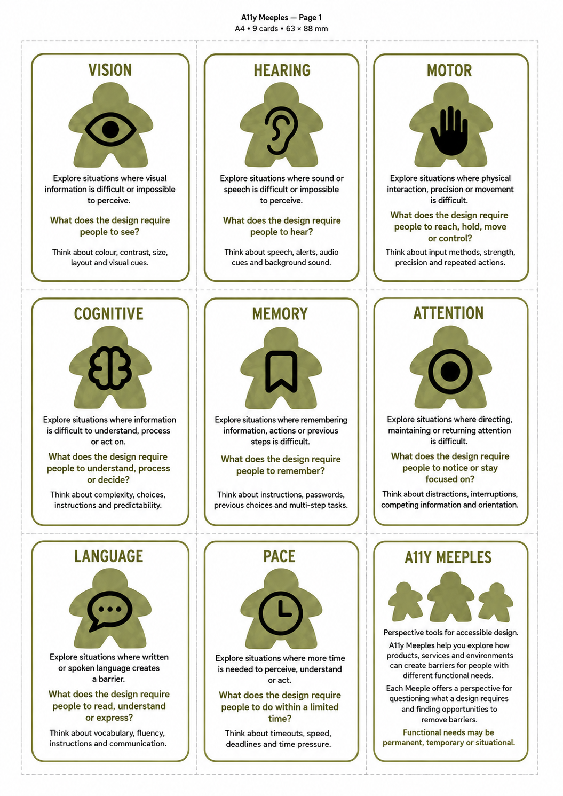
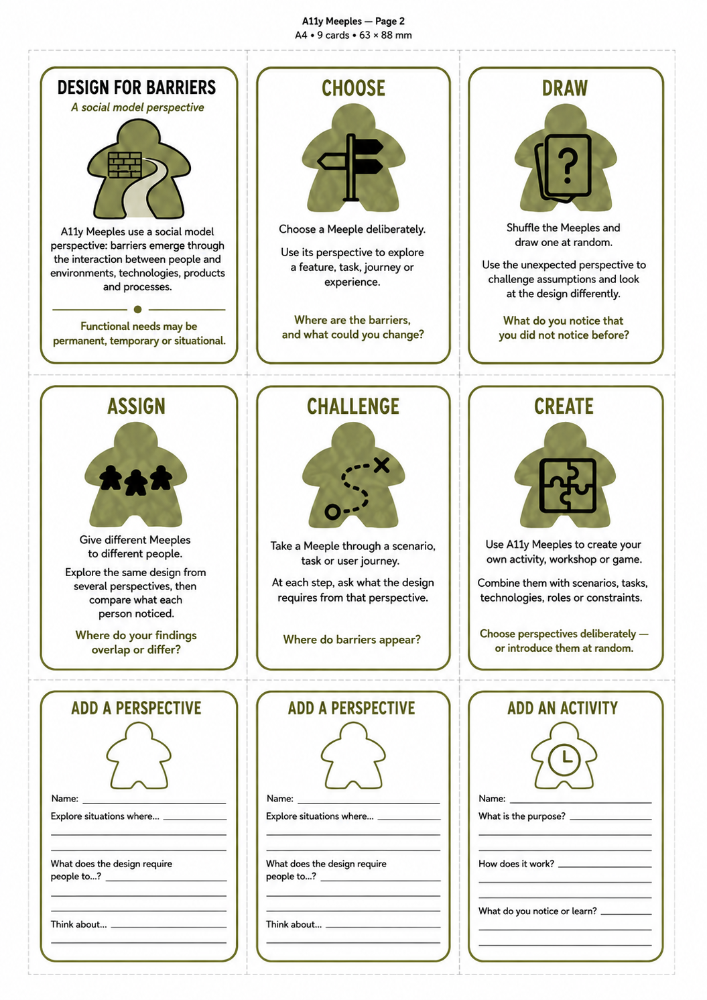
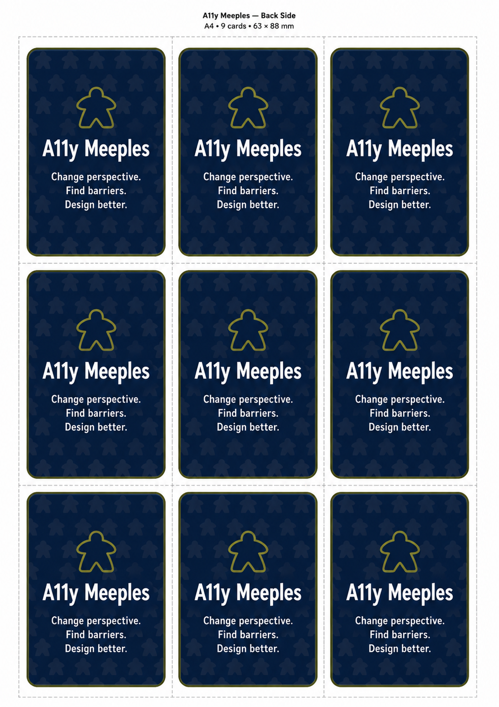

# A11y Meeples

Part of [A11y Intuition Lab](https://a11y-intuition-lab.github.io) — *Play. Reflect. Design for everyone.*

A11y Intuition Lab helps students and IT professionals develop the knowledge,
skills, attitudes, and habits to make digital accessibility part of everyday
practice. We create open, hands-on learning tools that make human variation,
context, and digital barriers tangible.

## What this is

A11y Meeples is a deck of perspective cards for exploring how products,
services and environments create barriers for people with different
functional needs: **Vision, Hearing, Motor, Cognitive, Memory, Attention,
Language** and **Pace**. Each Meeple offers a perspective for questioning
what a design requires and finding opportunities to remove barriers, using a
social-model view of disability: barriers emerge through the interaction
between people and their environment, not from the person alone.

Use a Meeple to:
- **Choose** it deliberately to explore a feature, task, journey or experience.
- **Draw** one at random and use the unexpected perspective to challenge assumptions.
- **Assign** different Meeples to different people and compare what each noticed.
- **Challenge** a design by walking a Meeple through a scenario or user journey.
- **Create** your own activity, workshop or game with them.

Blank cards are included so you can add your own perspectives and activities.

| | | |
|---|---|---|
|  |  |  |

## Print & play

Open [`index.html`](index.html) in a browser and print:

> Ctrl/Cmd+P → Margins: **None** → Background graphics: **On** → Paper: **A4**

The file also includes a fold-and-glue tuck box template sized for the
63×88 mm cards. A pre-rendered PDF is available at
[`print/a11y-meeples-cards.pdf`](print/a11y-meeples-cards.pdf).

## License

TBD.
